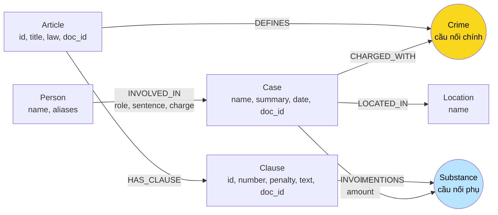

# Thiết kế Ontology — Day 19

**Họ tên:** Nguyễn Quốc Cường  **MSSV:** 2A202602886

**Lựa chọn** (đánh dấu một):
- [x] Dùng ontology gợi ý (có thể chỉnh nhỏ)
- [ ] Tự thiết kế (xét bonus +15, xem `SUBMISSION.md`)

**Phạm vi:** ontology gợi ý với 7 label và 7 loại quan hệ, đã triển khai KG-1 đến KG-4 trong `src/graph.py`. Đối chiếu ngày 05/10/2026: graph có **201 node / 382 cạnh**, đúng các label và quan hệ mô tả dưới đây. [Báo cáo](REPORT_KG.md) và [ghi chép Bước 8](STEP8.md) trình bày kết quả thực tế. Các đề xuất chuẩn hóa nâng cao và khử trùng chưa triển khai được ghi rõ, không xem là tính năng đã có.

### Cơ sở từ Bước 1

- KB luật có **18 tài liệu**: Điều 247–259 BLHS (13 điều) và Điều 1–5 Luật Phòng, chống ma túy (5 điều). Mỗi file là một Điều, có metadata `doc_id`, `article`, `law`, `document_version`, `source_url`. BLHS trong corpus là bản 2015 sửa đổi 2017; Luật PCMT là bản 2021. Thiết kế và đáp án dưới đây đối chiếu đúng các bản lưu trong repo.
- KB tin có **20 bài**, mỗi file là một bài, có `doc_id`, tiêu đề, nguồn và thời điểm xuất bản trong `document_version`. Một bài có thể chứa nhiều vụ; nhiều bài có thể nhắc lại cùng một vụ.
- Đã đọc [Điều 251](../data/drug_law/blhs-dieu-251.md), các Điều 250, 255 và Điều 2 Luật PCMT; đối chiếu sáu câu trong [benchmark](../data/benchmark_kg.json). Luật có cấu trúc Điều → khoản → điểm, còn tin dùng câu văn tự do, tên gọi tắt và biệt danh.

| Bài đã đọc | Dữ kiện ảnh hưởng đến thiết kế |
| --- | --- |
| [Lê Minh Thành](../data/drug_news/news-100260918080821054.md) | Thành bị tuyên 36 tháng tù ở sơ thẩm; ba người khác mỗi người 24 tháng. MDMA được xác nhận qua giám định. Cuối bài có đoạn giới thiệu vụ Cái Quang Huy, không được nhập vào vụ Thành. |
| [Cái Quang Huy](../data/drug_news/news-100260917203001265.md) | Tội vận chuyển; Huy chịu trách nhiệm hơn 9,6kg MDMA và khoảng 406g Ketamine, trong khi Đạt liên quan gần 4,3kg MDMA. Không cộng lại số tổng với từng lần vận chuyển. Nguyễn Hữu Đức đã được hủy quyết định khởi tố, không gán cho người này tội của Huy. |
| [Hoàng Nato](../data/drug_news/news-100260920221957595.md) | Dương Minh Tuấn có biệt danh Hoàng Nato, bị bắt để điều tra hành vi tổ chức sử dụng. Bài còn nói về các đường dây mua bán khác; không gán mọi hành vi của chuyên án cho Tuấn. |
| [Vụ hơn 36kg](../data/drug_news/news-100260928173914514.md) | Trần Thanh Tuấn và Trần Minh Tâm bị tuyên tử hình; các bị cáo khác có mức án, thậm chí tội danh khác. Mức án phải gắn với từng người trong vụ. |
| [Viện Pháp y tâm thần, 24-9](../data/drug_news/news-100260924105118645.md) và [30-9](../data/drug_news/news-100260930085028036.md) | Đều nhắc vụ liên quan Lê Văn Đông, Nguyễn Thị Mai Anh và ma túy thu tại viện; cần kiểm tra trùng vụ khi tổng hợp Q6. Bài sau nêu 0,686g MDMA, bài trước không nêu khối lượng này. |

Các thực thể riêng của KB luật là **Điều luật, khoản luật**; riêng của KB tin là **người, vụ việc, địa điểm**. **Tội danh và chất ma túy** xuất hiện ở cả hai KB. Tên người, mức án thực tế và địa điểm không có đối tượng tương ứng trong KB luật để làm cầu nối trực tiếp.

## 1. Sơ đồ

`Crime` là cầu nối chính; `Substance` là cầu nối phụ để chọn khoản liên quan và tổng hợp các vụ cùng chất.



## 2. Entity types (node labels)

| Label | Ý nghĩa | Khóa định danh (`MERGE` theo) | Properties | Lấy từ KB nào | Trích bằng (regex / LLM / khác) |
| --- | --- | --- | --- | --- | --- |
| `Article` | Một Điều thuộc một luật | `id`, ví dụ `Điều 251 BLHS`, `Điều 2 Luật PCMT` | `id`, `title`, `law`, `doc_id` | Luật | Metadata và regex, `parse_law_article` |
| `Clause` | Một khoản, giữ nguyên các điểm bên trong | `id` = `Article.id` + ` khoản ` + số khoản | `id`, `number` (số nguyên), `penalty`, `text`, `doc_id` | Luật | Regex đầu dòng `^(\d+)\.\s`, bỏ chú thích `[n]` |
| `Crime` | Tội danh chuẩn được định nghĩa trong BLHS | `name`, ví dụ `mua bán trái phép chất ma túy` | `name` | Luật tạo danh mục; tin liên kết vào | Tiêu đề Điều bắt đầu bằng `Tội `; tin trích bằng LLM rồi `link_entity` |
| `Case` | Vụ việc được mô tả trong một bài | `name` theo HINT | `name`, `summary`, `date`, `doc_id`, `source_title` | Tin | LLM; tên có người/vụ chính và địa điểm nếu bài cung cấp |
| `Person` | Người được nêu trong vụ | `name` (họ tên đầy đủ khi biết) | `name`, `aliases` (danh sách chuỗi) | Tin | LLM lấy tên và biệt danh được bài xác nhận |
| `Substance` | Tên chất hoặc nhóm chất được nguồn nêu | `name`, ưu tiên danh mục `SUBSTANCES`, ví dụ `MDMA`, `Ketamine` | `name` | Cả hai | Luật: `find_substances`; tin: LLM với danh sách chuẩn |
| `Location` | Địa điểm của vụ việc, prompt ưu tiên tỉnh/thành phố | `name`, ví dụ `Hà Nội`, `TP.HCM` | `name` | Tin | LLM; chưa có bước hậu kiểm chuẩn hóa tên địa điểm |

**Quy tắc định danh và nguồn:**

- Tạo uniqueness constraint theo khóa trong bảng trước khi `MERGE`. Khóa Điều chứa tên luật, tránh nhập Điều 2 của hai luật thành một node. Mỗi luật trong corpus hiện chỉ có một phiên bản; khóa này chưa đủ cho dữ liệu nhiều phiên bản.
- `Article`, `Clause`, `Case` phải có `doc_id = Document.id` để `seed_facts()` nối từ kết quả vector sang graph. `Crime`, `Substance`, `Person`, `Location` được xem là thực thể dùng chung theo HINT; nguồn của một sự kiện được truy ngược qua `Case` hoặc `Article`/`Clause`, không gán một `doc_id` tùy ý cho thực thể dùng chung. URL đầy đủ tra lại từ metadata hoặc `sources.csv` bằng `doc_id`.
- Với người có hai cách gọi, chỉ hợp nhất khi nguồn xác nhận chúng cùng chỉ một người: `Dương Minh Tuấn`, `aliases = ['Hoàng Nato']`. Tên ngắn như “Tuấn” chỉ được giải nghĩa trong ngữ cảnh bài; không fuzzy-match tên người trên toàn corpus. Khóa theo tên vẫn có thể nhập nhầm hai người trùng họ tên, đây là hạn chế được chấp nhận của baseline.
- Hiện `Case` MERGE theo `name` do LLM đặt và cập nhật `doc_id`; tên giống nhau có thể ghi đè nguồn, tên khác nhau có thể tách cùng một vụ. **Đề xuất chưa triển khai:** kiểm tra xung đột `name`/`doc_id`, phân biệt hồ sơ theo nguồn và chỉ hợp nhất khi có chứng cứ cùng vụ. Không coi MERGE theo tên là cơ chế khử trùng thực thể ngoài đời.
- `sentence` là mức án **đã được bài nêu**, nằm trên cạnh người–vụ; `penalty` là khung hình phạt **trong luật**, nằm trên khoản. Không tạo node mức án vì sáu câu hỏi không cần dùng mức án làm cầu nối. Chuỗi rỗng nghĩa là chưa có dữ kiện, không phải mức án bằng 0.

## 3. Relationships

| Type | Từ → Đến | Properties trên cạnh | Ý nghĩa |
| --- | --- | --- | --- |
| `DEFINES` | `Article` → `Crime` | Không | Điều BLHS định nghĩa một tội. Các Điều PCMT về phạm vi, thuật ngữ, chính sách không tạo `Crime`. |
| `HAS_CLAUSE` | `Article` → `Clause` | Không | Khoản thuộc Điều; số khoản nằm ở `Clause.number`. |
| `MENTIONS` | `Clause` → `Substance` | Không | Nội dung khoản nhắc đến chất; không đồng nghĩa khoản chắc chắn áp dụng cho vụ. |
| `CHARGED_WITH` | `Case` → `Crime` | Không | Tội danh/hành vi được nguồn gắn với vụ; đây là nhãn quan hệ kỹ thuật, không chứng minh đã truy tố hoặc kết án. |
| `INVOLVES` | `Case` → `Substance` | `amount` (chuỗi do LLM trích, ví dụ `9.6kg`, `5 viên`) | Chất và lượng liên quan vụ; chưa có hậu kiểm đảm bảo giữ từ “hơn/gần” hoặc đúng nơi thu giữ. |
| `LOCATED_IN` | `Case` → `Location` | Không | Địa bàn vụ việc theo nguồn; không tự coi quê quán hoặc nơi cư trú của người là nơi phạm tội. |
| `INVOLVED_IN` | `Person` → `Case` | `role`, `sentence`, `charge` | Vai trò, mức án và tội danh của riêng người đó trong vụ. `charge` chuẩn hóa về cùng tên `Crime`, hoặc rỗng nếu không đủ thông tin. |

Các cạnh có hướng để ghi dữ liệu nhất quán, truy vấn có thể đi ngược hướng đã lưu. Trong vụ có nhiều tội, chỉ đi từ một người tới `Crime` khi `INVOLVED_IN.charge = Crime.name`; không lấy toàn bộ tội của vụ để gán cho mọi người. Baseline chỉ có một chuỗi `charge` và `sentence` trên mỗi cặp người–vụ, chưa mô hình hóa nhiều tội và mức án riêng cho từng tội của cùng một người.

## 4. Node cầu nối giữa 2 KB

- **Node chính:** `Crime`. Đường `Case → Crime ← Article` dài hai cạnh, nối dữ kiện vụ án với điều luật mà không cần bài báo viết số Điều. Từ `Person` đến `Clause` qua đường này dài bốn cạnh.
- **Node phụ:** `Substance`. Đường `Case → Substance ← Clause ← Article` lấy các khoản nhắc cùng chất. Phải kết hợp với tội danh: MDMA xuất hiện trong nhiều Điều, nên chỉ dùng chất sẽ lẫn mua bán, vận chuyển và tàng trữ.
- **Chuẩn hóa tội danh đã triển khai:** lấy danh sách chuẩn từ tiêu đề 13 Điều BLHS, đưa vào prompt tin; KG-1 chuẩn hóa khoảng trắng, chữ hoa/thường, dấu ngoặc kép và tiền tố `Tội ` ở cả hai phía. Ưu tiên khớp chính xác, sau đó `difflib.get_close_matches(..., cutoff=0.8)`, trả đúng tên gốc hoặc `None`. Biến thể `ma tuý`/`ma túy` được xử lý bằng fuzzy matching, chưa có chuyển đổi Unicode NFC hoặc bảng alias riêng. Không bỏ toàn bộ dấu tiếng Việt.
- **Tên chất hiện tại:** luật dùng `SUBSTANCES` và tìm chuỗi con; tin được LLM nhắc dùng tên chuẩn trong prompt nhưng chưa có hậu kiểm trong code. E3 đã xác nhận Ketamine/ketamine và Methamphetamine/methamphetamine tách thành node khác. **Đề xuất:** chuẩn hóa chữ hoa/thường và map tên chuẩn trước khi ghi; không mặc định “kẹo”, “thuốc lắc”, “nước vui” là MDMA khi nguồn không xác nhận. Chất ngoài danh mục như etomidate chưa tự nối với một ngưỡng luật.

| Tình huống cầu nối hỏng hoặc nối sai | Biện pháp thiết kế; cần đối chiếu trạng thái triển khai ở trên |
| --- | --- |
| Khác cách viết, dấu hoặc Unicode tổ hợp | Chuẩn hóa hai phía trước `link_entity`; kiểm tra tên chuẩn thực tế sau trích xuất. |
| “Sử dụng” bị ép thành “tổ chức sử dụng” vì hai chuỗi giống nhau | Chỉ liên kết khi ngữ cảnh xác nhận hành vi; fuzzy matching chỉ là hỗ trợ tên, không quyết định tội danh. Không đủ căn cứ thì bỏ cạnh và giữ mô tả trong `summary`. |
| Tội hối lộ, đánh bạc trong bài Viện Pháp y không có trong KB luật | Không ép về một trong 13 tội ma túy; giữ thông tin trong văn bản, chỉ nối các tội có căn cứ tương ứng. |
| Không nhận ra Hoàng Nato là Dương Minh Tuấn | Trích `aliases` từ câu giới thiệu của bài, dùng cả tên và biệt danh để tìm seed. |
| Đoạn giới thiệu bài liên quan bị nhập vào vụ chính | Tách ngữ cảnh vụ; chỉ trích vụ được bài mô tả đủ, bỏ đoạn dẫn sang bài khác. Kiểm tra JSON thử trên bài Thành và bài Huy. |

**Quy trình trích xuất đã triển khai:** luật dùng regex tách khoản và giữ `text`, kể cả khoản không có hình phạt; tin dùng LLM ở chế độ JSON và hậu kiểm tội danh bằng `link_entity`. Prompt yêu cầu chỉ dùng nguồn, bỏ trống thông tin không rõ và trả `cases: []` cho bài không có vụ. Code có bắt lỗi đọc JSON nhưng chưa kiểm tra đầy đủ schema, tên chất, ngữ cảnh đoạn dẫn, mâu thuẫn người–vụ hay giai đoạn tố tụng. Ngày, vai trò và summary phụ thuộc kết quả LLM; chưa có node sự kiện để biểu diễn lịch sử tố tụng. Đây là giới hạn thực tế, được phân tích ở E3–E5.

## 5. Competency questions

Các pattern dưới đây mô tả khả năng truy xuất theo schema. Đáp án sinh bởi LLM được chấm riêng trong benchmark: Q1–Q5 Graph đạt recall 1.00/judge 2, Q6 đạt 0.67/1; Q5 vẫn bỏ Ketamine so với gold. Khả năng có đường đi không đồng nghĩa câu trả lời cuối luôn đầy đủ.

| Câu | Đường đi (Cypher pattern) | Trả lời được? |
| --- | --- | --- |
| Q1 | `(a:Article {id:'Điều 2 Luật PCMT'})-[:HAS_CLAUSE]->(cl:Clause {number:4})` | Có: lấy `cl.text` định nghĩa tiền chất; chỉ cần KB luật. |
| Q2 | `(p:Person)-[r:INVOLVED_IN]->(k:Case {doc_id:'news-100260928173914514'})` | Có: chọn đúng vụ hơn 36kg, phiên tòa 28-9 và `r.sentence` là tử hình; trả Trần Thanh Tuấn, Trần Minh Tâm. Chỉ cần KB tin. |
| Q3 | `(p:Person {name:'Lê Minh Thành'})-[r:INVOLVED_IN]->(k:Case)-[:CHARGED_WITH]->(c:Crime)<-[:DEFINES]-(a:Article)-[:HAS_CLAUSE]->(cl:Clause {number:1})` | Có khi `r.charge = c.name`: mức án 36 tháng, tội mua bán, Điều 251, khung cơ bản 02–07 năm. Cần cả hai KB. |
| Q4 | `(p:Person)-[r:INVOLVED_IN]->(k:Case)-[:CHARGED_WITH]->(c:Crime)<-[:DEFINES]-(a:Article)-[:HAS_CLAUSE]->(cl:Clause)` | Có: tìm `p` qua alias Hoàng Nato, lọc tội của riêng người, lấy các khoản của Điều 255 để xác định khung cao nhất. Cần cả hai KB. |
| Q5 | `(p:Person {name:'Cái Quang Huy'})-[r:INVOLVED_IN]->(k:Case)-[:CHARGED_WITH]->(c:Crime)<-[:DEFINES]-(a:Article)-[:HAS_CLAUSE]->(cl:Clause)` kết hợp `(k)-[i:INVOLVES]->(s:Substance)<-[:MENTIONS]-(cl)` | Có ở mức GraphRAG đọc văn bản: lọc tội vận chuyển của Huy, chất MDMA và đối chiếu lượng trong `i.amount` với `cl.text`. Không có phép chọn ngưỡng tự động bằng thuộc tính số. |
| Q6 | `(k:Case)-[:INVOLVES]->(:Substance {name:'MDMA'})`, bổ sung `(p:Person)-[:INVOLVED_IN]->(k)` | Có thể liệt kê các hồ sơ tin liên quan, rồi đối chiếu để nhóm thành ba vụ theo benchmark. Schema chưa bảo đảm khử trùng vụ ngoài đời giữa nhiều bài. |

### Điều kiện truy xuất để không bỏ sót dữ kiện

**Q1 — định nghĩa:** từ các tài liệu luật được vector truy xuất, đọc `Clause.text` để tìm thuật ngữ “tiền chất”; khoản 4 Điều 2 Luật PCMT chứa đủ nội dung về hóa chất cần cho điều chế, sản xuất và danh mục tiền chất. `seed_facts()` chỉ in cạnh và property trên cạnh, không tự đưa `Clause.text` vào prompt; KG-3 phải bổ sung phần này. Không chỉ lấy khoản 1 vì đây là câu hỏi định nghĩa. Flat RAG có thể đủ nếu lấy đúng đoạn.

**Q2 — mức án thực tế:** trả tên từ cạnh người–vụ có mức án tử hình, không suy ra từ khung luật. `Case.date` biểu diễn phiên tòa 28-9 nếu trích được, còn `source_title`/`summary` xác nhận vụ hơn 36kg. Flat RAG có thể đủ vì hai tên nằm ngay đầu bài.

**Q3 — đi xuyên KB:** mức án của Thành lấy từ `r.sentence`; khung cơ bản lấy từ `cl.penalty` và `cl.text` của khoản 1. Hai con số khác ý nghĩa. Vụ trong bài đang có kháng cáo của ba người khác, nên không biến mức án sơ thẩm được tường thuật thành kết quả phúc thẩm mới. Flat RAG có thể thiếu Điều 251 nếu top-k tập trung vào bài báo.

**Q4 — mức tối đa:** truy xuất tất cả khoản thuộc đúng Điều 255, đọc các khung hình phạt và xác định khoản 4 có mức 20 năm hoặc tù chung thân. Không dùng `max(cl.number)` vì khoản 5 là hình phạt bổ sung; không chỉ lấy khoản 1 hoặc khoản có `MENTIONS` vì các khoản của Điều 255 không cần nêu tên chất. “Chung thân” là mức cao nhất trong Điều theo corpus, không phải mức án đã tuyên cho Hoàng Nato. Flat RAG cần cả bài báo và phần cuối điều luật.

**Q5 — lượng và ngưỡng:** trước hết lấy MDMA cùng Ketamine của vụ Huy; sau đó chỉ dùng MDMA để trả phần đối chiếu ngưỡng được hỏi. `hơn 9,6kg` tương ứng hơn 9.600g, vượt mốc 100g ở **điểm b khoản 4 Điều 250** trong corpus; khoản này ghi 20 năm, tù chung thân hoặc tử hình. Đưa nguyên văn khoản và lượng vào context để câu trả lời có căn cứ. Không hard-code khoản 4 từ đáp án: lấy các khoản cùng Điều có `MENTIONS` MDMA rồi so nội dung ngưỡng. `MENTIONS` riêng lẻ không đủ để chọn khoản. Không gán hơn 9,6kg cho Đạt, không đổi 5 viên trong vụ Thành ra khối lượng, không cộng MDMA và Ketamine hay suy ra công thức tương đương. Đây là đối chiếu phục vụ benchmark, chưa phải kết luận về khoản đã được tòa áp dụng. Flat RAG dễ thiếu một trong ba dữ kiện: tội danh, lượng, khoản tương ứng.

**Q6 — tổng hợp toàn graph:** lấy mọi `Case` nối với MDMA, không giới hạn vào các `doc_id` top-k của vector. `DISTINCT k` loại hàng lặp do nhiều cạnh, nhưng không hợp nhất các node khác nhau cùng chỉ một vụ. Trả kèm `doc_id`, `summary`, người liên quan để đối chiếu các nhóm: Huy vận chuyển qua Nội Bài; Thành và ba thanh niên; Viện Pháp y tâm thần. Hai bài 24-9 và 30-9 là bằng chứng bổ sung cho nhóm thứ ba. Nếu chưa xác minh được hai hồ sơ cùng vụ, giữ riêng nguồn và nêu khả năng trùng, không khẳng định số vụ duy nhất. Flat RAG top-k nhỏ không bảo đảm lấy đủ mọi bài.

Ví dụ Cypher tổng hợp Q6, dành cho bước triển khai và kiểm tra sau:

```cypher
MATCH (k:Case)-[:INVOLVES]->(:Substance {name:'MDMA'})
OPTIONAL MATCH (p:Person)-[:INVOLVED_IN]->(k)
RETURN k.name AS case_name, k.doc_id AS doc_id, k.summary AS summary,
       collect(DISTINCT p.name) AS people
ORDER BY doc_id, case_name;
```

## 6. Quyết định thiết kế và đánh đổi

| Quyết định | Phương án đã chọn | Phương án khác và đánh đổi |
| --- | --- | --- |
| Độ chi tiết luật | Node đến **khoản**, giữ các điểm trong `Clause.text` | Tách node `Point` và ngưỡng số giúp Q5 suy luận có cấu trúc hơn, nhưng cần parser xử lý nhóm chất, thể rắn/lỏng và điều kiện tương đương. Corpus nhỏ nên chấp nhận đọc văn bản khoản. |
| Cầu nối | `Crime` xác định Điều; `Substance` lọc khoản và gom vụ | Chỉ nối theo chất sẽ lẫn tội danh; nối trực tiếp vụ–Điều đòi hỏi tin nêu số Điều hoặc thêm bước suy diễn thiếu căn cứ. |
| Mức án và khung luật | `INVOLVED_IN.sentence` riêng theo người–vụ; `Clause.penalty` riêng theo khoản | Đặt mức án trên `Person` hoặc `Case` sẽ sai khi một vụ có nhiều mức án hoặc một người có nhiều vụ. Node hình phạt riêng chưa cần cho Q1–Q6. |
| Khóa thực thể | Giữ khóa của HINT; chuẩn hóa tên, aliases và kiểm tra xung đột nguồn trước ghi | ID bền vững, node bài báo và bảng hợp nhất thực thể tốt hơn cho dữ liệu lớn, nhưng tăng phạm vi triển khai. Baseline chưa giải quyết triệt để trùng tên và trùng vụ. |
| Cách trích xuất | Regex cho luật; LLM cho tin, hậu kiểm tên chuẩn và ngữ cảnh | LLM cho toàn bộ luật tốn thêm chi phí và kém ổn định; regex thuần cho tin khó gắn đúng người với tội, mức án và biệt danh. |
| Phạm vi mở rộng context | Theo ý định câu hỏi: định nghĩa lấy khoản chứa thuật ngữ; mức tối đa lấy đủ khoản của đúng Điều; khối lượng lấy các khoản liên quan chất; tổng hợp duyệt toàn bộ vụ liên quan chất | Luôn chỉ lấy khoản 1 và khoản có chất sẽ hụt Q1/Q4; luôn lấy toàn graph làm prompt dài và nhiều nhiễu. Cần giữ dữ kiện trực tiếp trả lời câu hỏi trước khi áp giới hạn `max_facts`. |
| Giai đoạn tố tụng | Giữ cách diễn đạt nguồn trong `summary`, `role`, `sentence` | Node sự kiện theo thời gian sẽ phân biệt điều tra, truy tố, sơ thẩm, phúc thẩm rõ hơn. Baseline nhẹ hơn nhưng không trả lời đầy đủ lịch sử tố tụng. |

## 7. So với ontology gợi ý (bắt buộc nếu xét bonus)

| Điểm khác | Gợi ý làm gì | Bạn làm gì | Vấn đề nó giải quyết | Bằng chứng (Cypher, hoặc số liệu benchmark) |
| --- | --- | --- | --- | --- |
| Schema | 7 label, 7 quan hệ | Giữ nguyên | Tận dụng các hàm HINT | Ảnh và kết quả kiểm tra chỉ đọc ghi trong báo cáo xác nhận đủ 7 label/7 quan hệ |
| Truy xuất | Gợi ý khởi đầu bằng khoản 1 và khoản nhắc chất | Có nhánh định nghĩa, mức tối đa, tổng hợp theo chất và lọc tội theo người trong context | Bổ sung dữ kiện phù hợp loại câu hỏi | Benchmark Q1/Q4 Graph đạt 1.00/2; Q6 còn 0.67/1. Không có benchmark HINT đối chứng để khẳng định mức cải thiện riêng của thay đổi này |

**Không đăng ký bonus tự thiết kế.** Các điều chỉnh là quy tắc truy xuất trên ontology gợi ý. Label và quan hệ đã đối chiếu với graph; chưa có bộ benchmark HINT trước/sau để xét bonus. Các biện pháp làm sạch và chuẩn hóa chưa cài đặt vẫn là đề xuất sửa lỗi.

## 8. Hạn chế còn lại

1. **Chưa có ngưỡng có kiểu dữ liệu số:** Q5 cần đọc `amount` và `text`, nên vẫn có nguy cơ sai đơn vị, dấu thập phân hoặc điều kiện áp dụng. Graph chỉ bảo đảm truy xuất các ứng viên; không tự chứng minh khoản phù hợp.
2. **Khóa tên còn yếu:** người trùng tên có thể bị nhập; người/vụ đổi cách gọi có thể bị tách. `Person.aliases` và `Case.doc_id` có thể bị ghi đè khi dùng nguyên HINT cho nhiều bài, nên cần hậu kiểm ở bước dựng graph. Không tuyên bố Q6 đếm chính xác số vụ duy nhất.
3. **Khối lượng gắn với vụ, không với từng người/lần thu giữ:** bài Huy có tổng lượng và nhiều đợt vận chuyển. Schema không biểu diễn được trách nhiệm khối lượng riêng của từng người; phải giữ phân biệt trong `summary` và văn bản nguồn. Chỉ ghi tổng trên `INVOLVES.amount` khi nguồn xác nhận rõ tổng của vụ, không tự cộng các đoạn lặp.
4. **Không có lịch sử tố tụng hay nhiều bản án:** một cạnh người–vụ không đủ lưu các thay đổi qua sơ thẩm, phúc thẩm hoặc nhiều tội độc lập. Có thể trả thông tin được bài nêu nhưng chưa giải quyết xung đột giữa các bài.
5. **Phạm vi luật giới hạn:** không có các Điều về hối lộ, đánh bạc hoặc Điều 16 được tin dẫn. Không nối bừa tội ngoài danh mục và không khẳng định corpus phản ánh pháp luật hiện hành tại mọi thời điểm; chưa mô hình hóa hiệu lực hay sửa đổi luật.
6. **Danh mục chất và địa điểm chưa đầy đủ:** `find_substances` hiện tìm chuỗi con, không giải nghĩa mọi tên đường phố hay dạng chế phẩm. `Location` mức tỉnh/thành phố không mô hình hóa cả tuyến Đức → Nội Bài → Nghệ An.
7. **Chất lượng đầu vào và giới hạn context:** đoạn dẫn sang tin khác, JSON sai, bỏ sót alias hoặc cắt văn bản/prompt có thể làm thiếu cạnh. Khi triển khai phải kiểm tra JSON trên vài bài và các đường Q1–Q6; thiết kế này chưa thay thế kiểm thử KG-2/KG-3 hoặc kết quả benchmark.
